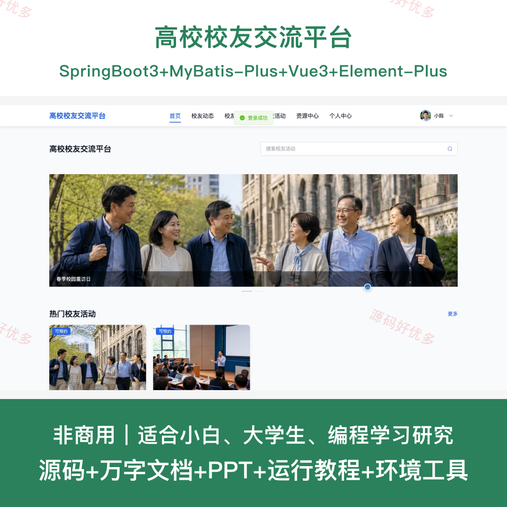
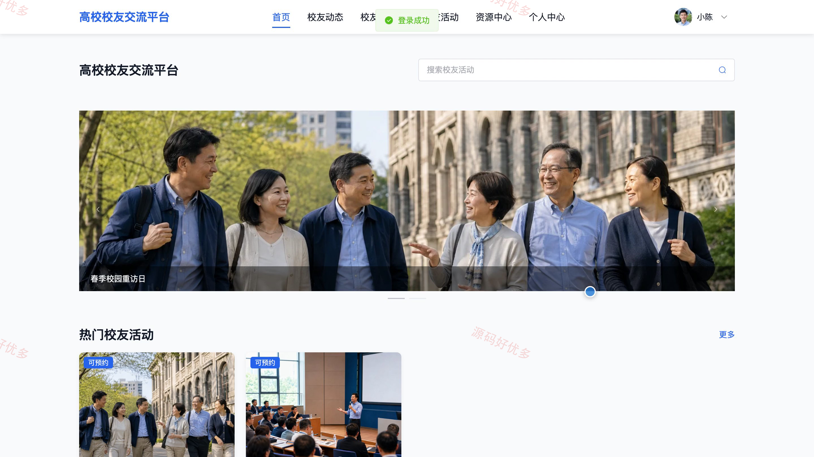
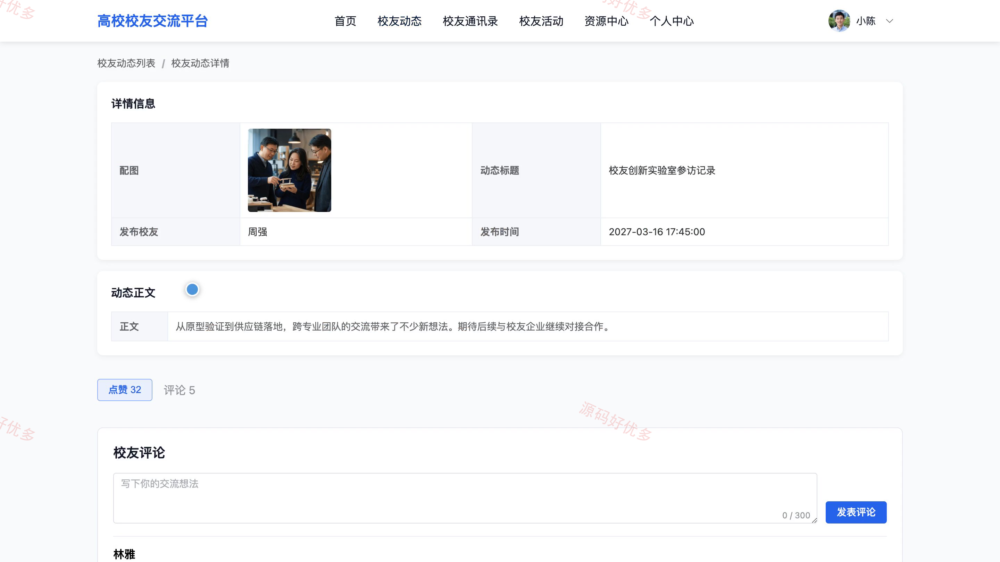
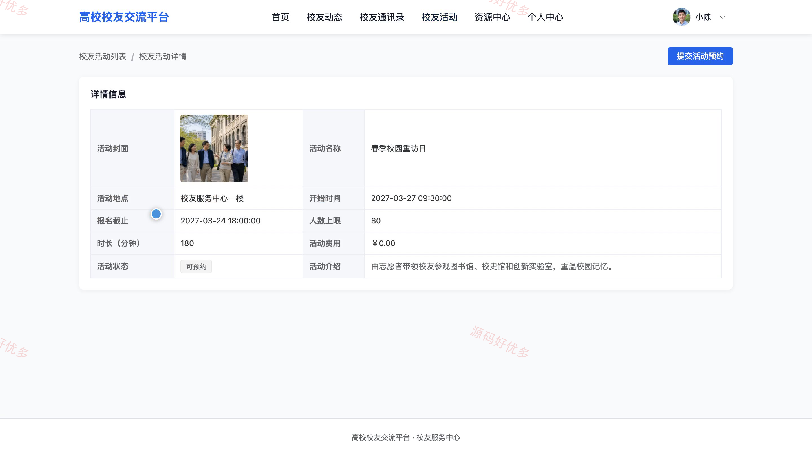
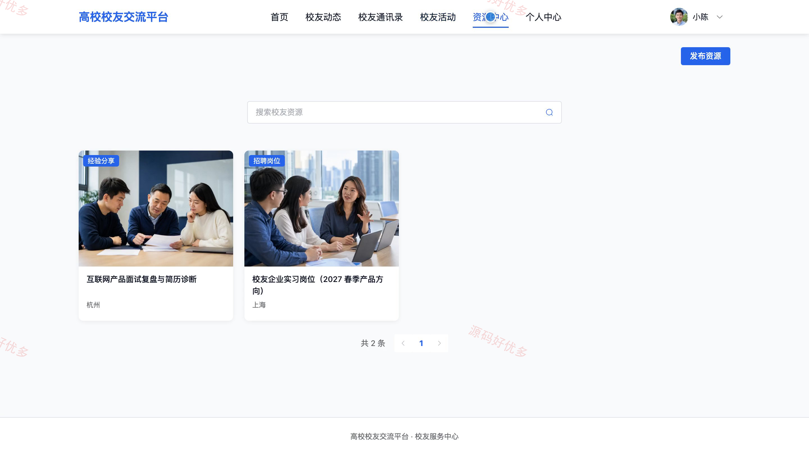
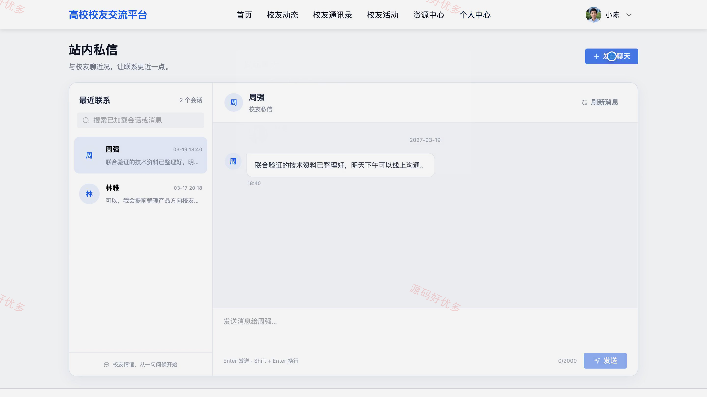
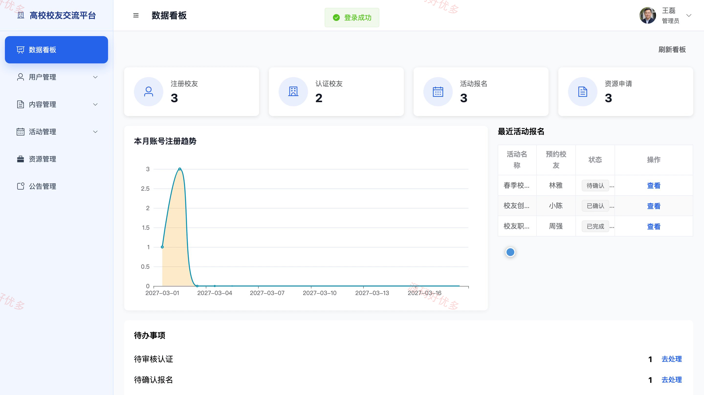
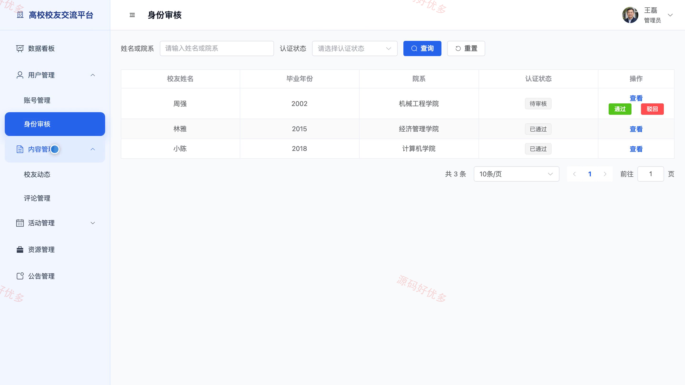
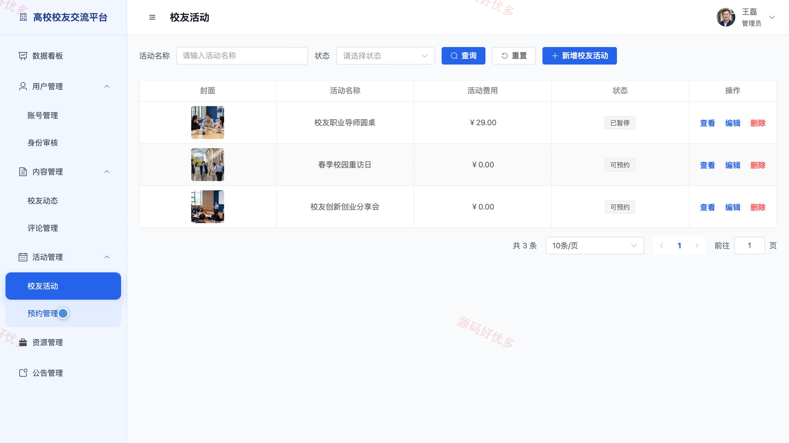

# bs113A
bs113A高校校友交流平台
## 源码问题查看主页咨询

### 一、关键词
校友交流、校友社区、同学录、校友资源共享、校友活动

### 二、作品包含
源码+数据库+万字设计文档+PPT+全套环境和工具资源+本地部署教程

### 三、项目技术
前端技术： Html、Css、Js、Vue3.4、Element-Plus
后端技术：Java、SpringBoot3.2.0、MyBatis-Plus

### 四、运行环境要求
开发工具：IDEA/eclipse + VSCODE

数据库：MySQL5.7+（共14张表）

数据库管理工具：Navicat10以上版本

环境配置软件： JDK17 + Maven3.6

前端Nodejs：16+

浏览器：谷歌浏览器

### 五、项目介绍
项目编号：bs113A

高校校友交流平台面向校友与管理员，串联身份认证、校友动态、通讯录检索、活动预约、资源对接和站内私信，并由后台完成内容维护与业务审核。

角色：用户、管理员

用户功能：账号注册与登录、校友身份认证、个人资料维护、校友动态发布与互动、校友通讯录筛选、活动预约与取消、校友资源发布与申请、资源申请处理与站内私信。

管理员功能：管理员登录、校友身份审核、用户管理、校友动态管理、评论管理、活动与预约管理、资源管理、公告与数据统计。

### 六、运行截图

